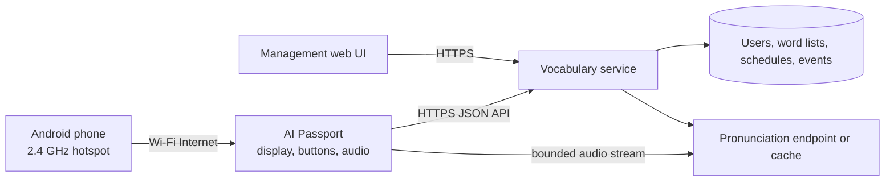

<p align="right">
  <a href="README.zh_CN.md">简体中文</a> · <strong>English</strong>
</p>

# IELTS Vocabulary Trainer Plan

Status: planned, not implemented. This document is the handoff specification for future development on another computer.

## Product goal

Add an IELTS-focused vocabulary trainer to AI Passport. The Android phone provides Internet access through a 2.4 GHz Wi-Fi hotspot. The device displays words, plays pronunciations, and sends study actions to a server. The server owns the word lists, learning schedule, progress, and statistics. A browser-based management interface lets the learner inspect progress and choose word lists.

The device remains a thin client. It may keep a small session cache and a retry queue so a temporary network loss does not lose progress, but it does not become the authoritative vocabulary database.

## Confirmed interaction contract

| Input | Behavior |
| --- | --- |
| Short press `UP` | Show the previous word in the current session. Do not create a second review record. At the beginning of the session, stay on the current word and show brief boundary feedback. |
| Short press `DOWN`, English side | Reveal the Chinese meaning. |
| Short press `DOWN`, meaning visible | Mark the card as known if it has not already been graded, then show the next word. For a previously graded card reached with `UP`, simply move forward without double-counting it. |
| Long press `DOWN` | Mark the current word as unfamiliar and advance to the next word. This works before or after revealing the meaning. A correction on a previously graded card replaces that card's result for the session instead of creating a duplicate. |
| Short press `OK` | Toggle automatic pronunciation. When switching it on, play the current word once as immediate feedback. The setting persists locally. |
| Long press `OK` | End the study session, flush pending events when possible, stop audio and network workers, and return to the main menu. |
| Long press `UP` | Reserved for a future feature. |

A long press consumes the corresponding short-press event. The initial implementation should use the repository's established button event timing instead of adding delays inside a button callback.

## Study experience

### Word front

- Show the English word as the dominant content.
- Do not show the Chinese meaning until `DOWN` is pressed.
- A small status area may show battery, network state, pronunciation state, and session progress without competing with the word.
- If automatic pronunciation is enabled, enqueue one pronunciation when the new word becomes visible.

### Meaning revealed

- Keep the English word visible and reveal the primary Chinese meaning below it.
- Optional secondary content for later versions: phonetic spelling, part of speech, and one short example sentence.
- The first release should keep the layout readable on the 240 × 320 display and avoid scrolling.

### Feedback and error states

- Show a brief non-blocking confirmation after an unfamiliar mark.
- Show distinct connecting, offline, syncing, audio-loading, and server-error states.
- If pronunciation fails, keep the card usable and show a small audio error indicator.
- If no card is available, show whether the daily goal is complete or the server is unavailable.

## System architecture



The server URL and protocol must be configurable. Firmware must not depend on a private development hostname or a hard-coded account.

## Device responsibilities

- Connect as a Wi-Fi station to the Android phone's 2.4 GHz hotspot.
- Authenticate with a revocable device token stored in NVS.
- Request a bounded study session and keep only enough cards for smooth navigation and short outages.
- Render the front/revealed states and reduce button events through a testable state machine.
- Queue review events with idempotency keys and retry them after reconnecting.
- Stream or download one pronunciation at a time using bounded buffers, then play it through the BSP audio API in a worker task.
- Keep LVGL calls inside the LVGL context or under `bsp_lvgl_lock()`.
- Keep button callbacks non-blocking; networking, JSON parsing, storage, and audio belong in workers.
- Stop every task, timer, callback, and audio/network operation before deleting the page.

The ESP32-C3 has no PSRAM. The implementation must set explicit limits for the session cache, JSON document size, HTTP receive buffer, audio buffer, task stacks, and UI objects before firmware integration.

## Server responsibilities

- Store vocabulary, Chinese meanings, word-list membership, pronunciation metadata, and stable word IDs.
- Select new and due cards using the active word list and the learner's schedule.
- Apply review results and calculate the next due time.
- Store an append-only review event history while maintaining a current per-word state.
- Provide session summaries and progress aggregates for the management UI.
- Generate or cache pronunciation audio and expose a device-friendly streaming endpoint.
- Issue, rotate, and revoke device tokens.
- Accept idempotent event retries without double-counting progress.

## Review model

The first version uses two explicit grades because the hardware interaction has only two outcomes:

- `known`: recorded by the second short `DOWN` press after revealing the meaning.
- `again`: recorded by a long `DOWN` press and presented in the UI as "unfamiliar."

Recommended server behavior:

- New words enter a learning queue.
- `again` resets the short interval, increases the lapse count, and prioritizes the word later in the same day.
- Consecutive `known` results increase the interval with a capped spaced-repetition formula.
- The schedule uses server time. Device timestamps are retained only as diagnostic context.
- Every session card has a stable `session_card_id`; repeated uploads replace or ignore the same card result according to its idempotency key.

The exact interval formula can evolve without a firmware update as long as the API contract and the `known`/`again` meanings remain stable.

## Initial data model

| Entity | Required fields |
| --- | --- |
| User | `id`, login identity, locale, timezone, daily limits |
| Device | `id`, owner, display name, token hash, last seen, firmware version, revoked time |
| Word | `id`, English lemma/display form, Chinese meaning, part of speech, phonetic text, audio revision |
| Word list | `id`, name, description, language pair, version, active status |
| Word-list entry | word-list ID, word ID, order, optional level/tags |
| Learner word state | user ID, word ID, state, due time, interval, known streak, lapse count, last result |
| Study session | `id`, user, device, word-list version, start/end time, counts |
| Session card | `id`, session, word, queue position, final result |
| Review event | idempotency key, session-card ID, result, server time, optional device time |

The IELTS word source, Chinese translations, example sentences, and audio must have a license that permits storage and redistribution. Source and license metadata belong with each imported word-list version.

## API draft

All device endpoints use HTTPS, a versioned path, bounded JSON responses, and bearer device authentication after activation.

| Method and path | Purpose |
| --- | --- |
| `POST /v1/devices/activate` | Exchange a short-lived pairing code for a revocable device token. |
| `GET /v1/device/config` | Fetch active word list, daily limits, pronunciation preference, and protocol limits. |
| `POST /v1/study/sessions` | Start or resume a session and return the first bounded card batch. |
| `GET /v1/study/sessions/{id}/cards?after=...` | Fetch the next bounded card batch. |
| `PUT /v1/study/sessions/{id}/cards/{card_id}/result` | Submit or correct `known`/`again` using an idempotency key. |
| `POST /v1/study/sessions/{id}/finish` | Close the session and return a summary. |
| `GET /v1/words/{id}/audio?voice=...` | Stream a pronunciation in a documented device-compatible format. |
| `GET /v1/sync/status` | Compare the device's acknowledged event cursor with the server. |

The first API contract should define maximum field lengths, response sizes, timeouts, retry rules, audio sample format, error codes, and compatibility behavior before firmware code is written.

## Provisioning and authentication

Recommended first-time setup:

1. The learner signs in to the management web UI and creates a device pairing code with a short expiry.
2. A local USB configuration tool writes the phone hotspot SSID/password, service URL, and one-time pairing code to the device.
3. The device connects through the phone hotspot, exchanges the pairing code for a token, and stores the token in NVS.
4. The server stores only a token hash and lets the learner revoke the device from the web UI.

Wi-Fi passwords, pairing codes, device tokens, server secrets, and private endpoints must never be committed. Logs must redact authorization headers and credentials.

## Management web interface

The web UI should be responsive so it works on the Android phone and a desktop browser. The MVP contains:

- **Dashboard:** today's new/review counts, accuracy, study time, due backlog, and current streak.
- **Word lists:** browse available IELTS lists, inspect metadata/version/license, select the active list, and set daily new/review limits.
- **Progress:** counts for new, learning, review, and mastered states; trend charts by day or week.
- **Unfamiliar words:** filter by lapse count, search, and optionally reset or suspend a word.
- **Session history:** start/end time, device, word-list version, known/again totals, and sync status.
- **Pronunciation settings:** preferred voice or accent and automatic-pronunciation default.
- **Devices:** pairing, last-seen status, firmware version, rename, and token revocation.

Server-side authorization must ensure one user cannot access another user's progress or devices.

## Connectivity and synchronization rules

- Wi-Fi loss must not freeze the UI or button handling.
- Cache a small bounded batch, initially 10 to 20 cards, and prefetch before the queue becomes empty.
- Persist unsent review events in a compact NVS-backed queue before showing the next card.
- Upload in order when practical, but rely on idempotency rather than timing for correctness.
- Keep the active session and event cursor across an ordinary reboot.
- If the cache is empty and the network is unavailable, show a retry screen; do not invent cards or silently discard actions.
- A server word-list version remains fixed for the lifetime of a session so changes in the web UI do not reorder an active session.

## Suggested firmware structure

| Area | Planned responsibility |
| --- | --- |
| `main/demo_vocabulary.c` | Page lifecycle, LVGL view, event dispatch, and worker coordination |
| `main/vocabulary_model.c/.h` | Pure card-navigation and button-action state machine with host tests |
| `main/vocabulary_client.c/.h` | Versioned API requests, bounded parsing, retries, and protocol errors |
| `main/vocabulary_store.c/.h` | NVS settings, active-session metadata, and pending-event queue |
| `main/pronunciation_player.c/.h` | Bounded HTTP/audio pipeline and BSP audio ownership |
| `tools/configure_vocabulary.py` | USB provisioning without embedding credentials in firmware |
| `tests/test_vocabulary_model.c` | Button/state transition and duplicate-result tests |

The server and web UI may live in separate repositories or in clearly isolated directories. Their deployment choice must not change the versioned device API without a migration plan.

## Delivery stages

1. **Contract and fixtures:** freeze the button state machine, JSON limits, error model, and sample API responses; add host tests.
2. **Device UI with a mock source:** implement English/reveal/navigation/unfamiliar/audio-toggle behavior without networking.
3. **Server MVP:** add authentication, one licensed IELTS list, session creation, two-grade scheduling, and progress storage.
4. **Online synchronization:** connect through the Android hotspot, add bounded card fetching, NVS retry queue, and reconnect behavior.
5. **Pronunciation:** add server-cached audio and bounded playback with cancellation on navigation or exit.
6. **Management web UI:** implement dashboard, word-list choice, unfamiliar-word view, settings, and device management.
7. **Hardware acceptance:** measure heap, task stacks, latency, reconnect behavior, audio stability, battery impact, and Wi-Fi/audio coexistence.

## Acceptance criteria

- A new card initially shows English without the Chinese meaning.
- The first short `DOWN` reveals Chinese; the second records `known` once and advances.
- Long `DOWN` records `again` once and advances from either card side.
- Short `UP` returns to the previous card without duplicating a review event.
- Short `OK` toggles automatic pronunciation and survives reboot; long `OK` exits cleanly.
- A temporary hotspot interruption does not block buttons or lose an already acknowledged user action.
- Replaying the same queued event does not change totals twice.
- The management UI can select a word list and shows progress that matches stored review events.
- Credentials remain outside source control, and device tokens can be revoked.
- Firmware preserves the 3 MB application limit and protected `cardid` partition.
- Host tests cover state transitions, idempotency behavior, bounded parsing, and scheduling logic; device tests cover real display, buttons, Wi-Fi, audio, and task cleanup.

## Initial defaults and open decisions

Development can start with these defaults: one user, one device, 20 new words per day, 100 review cards per day, a 10-card initial batch, British pronunciation when available, and Chinese as the meaning language.

Before production use, confirm:

- the licensed IELTS word-list and translation source;
- pronunciation source, redistribution rights, codec/sample format, and British/US fallback;
- hosting provider, domain, TLS certificate, backup, monitoring, and operating budget;
- account login method and whether multiple users or multiple devices are required;
- whether example sentences are in the first release;
- retention and export/deletion policy for study history.

## Handoff on another computer

```bash
git clone https://github.com/maple1999/ai-passport.git
cd ai-passport
git switch -c feature/ielts-vocabulary-trainer
```

Read `AGENTS.md`, this plan, the hardware guide, and the build/test guide before implementation. Begin with the pure state machine and API fixtures. Do not copy credentials from the previous computer; provision new local secrets and keep them outside Git.
