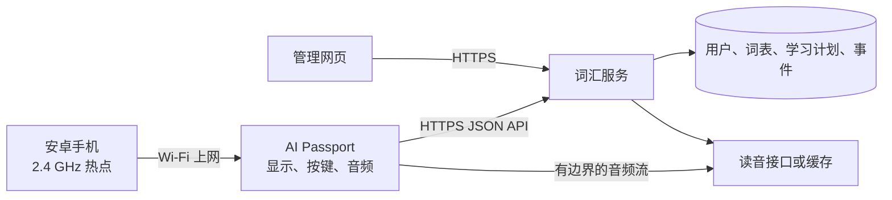

<p align="right">
  <strong>简体中文</strong> · <a href="README.md">English</a>
</p>

# 雅思背单词功能规划

状态：MVP 已实现；真机联网与交互验收仍待完成。本文同时记录已实现基线与后续目标范围。

## 产品目标

为 AI Passport 增加以雅思词汇为主的背单词功能。安卓手机通过 2.4 GHz Wi-Fi 热点提供网络；设备负责展示单词、播放读音，并将学习操作发送到服务器；服务器负责保存词表、安排复习、计算进度和生成统计；浏览器管理界面用于查看进度和选择词表。

## 已实现的 MVP 基线

- 主菜单中的 Display 条目已替换为 IELTS。对应 LVGL 页面每次最多获取 10 张卡片，实现释义揭示、认识、不熟悉、返回上一张、结束会话，并持久化读音偏好。
- Wi-Fi、HTTPS、JSON 解析、设备激活及进度提交均不在按键回调中运行。设备沿用已有 USB 串口通道完成配置，热点和服务凭据存入 NVS，不写入源码。
- `services/vocabulary` 提供单用户 FastAPI/SQLite 服务，包含设备令牌哈希、有数量上限的会话、幂等结果提交与修正、一组由项目自行编写的学术起步词，以及由令牌保护的进度页面。
- Docker 服务仅绑定 `127.0.0.1:18081`，可由现有反向代理公开，无需占用新的公网端口。
- 主机测试覆盖按键状态机，以及服务端的鉴权、复习安排、结果修正和幂等路径。

本 MVP 尚不包含单词读音播放、完整且有授权的雅思词表、设备端持久化离线事件、词表选择和完整真机验收。

设备保持为轻量客户端。它可以保存少量会话缓存和待重试队列，避免短时断网导致进度丢失，但服务器始终是词汇与学习记录的权威数据源。

## 已确定的按键交互

| 输入 | 行为 |
| --- | --- |
| 短按 `UP` | 返回当前学习会话中的上一个单词，不重复生成复习记录。已经位于第一个单词时保持当前页面，并短暂提示已到边界。 |
| 英文页短按 `DOWN` | 展示中文释义。 |
| 已展示释义时短按 `DOWN` | 若该卡片尚未评分，则标记为认识并进入下一个单词；若是通过 `UP` 返回的已评分卡片，则只向前移动，不重复计数。 |
| 长按 `DOWN` | 将当前单词标记为不熟悉并进入下一个单词；在英文页或释义页均可触发。若修改本会话中已评分的卡片，则替换该卡片的结果，不新增重复记录。 |
| 短按 `OK` | 开启或关闭自动读音。打开时立即播放当前单词一次作为反馈；设置保存在设备本地。 |
| 长按 `OK` | 结束学习会话，在条件允许时提交待同步事件，停止音频与网络任务，并返回主菜单。 |
| 长按 `UP` | 预留给后续功能。 |

长按事件必须吞掉对应的短按事件。首版应沿用仓库既有的按键事件时间，不得在按键回调中通过延时实现长按判断。

## 学习体验

### 单词正面

- 英文单词是页面主要内容。
- 在按下 `DOWN` 前不展示中文释义。
- 小型状态区域可以展示电量、网络状态、读音开关和本次进度，但不能干扰单词阅读。
- 自动读音开启时，新单词出现后排队播放一次。

### 展示释义

- 保留英文单词，在下方展示主要中文释义。
- 后续版本可增加音标、词性和一句较短的例句。
- 首版应保证 240 × 320 屏幕无需滚动即可清晰阅读。

### 反馈与异常状态

- 标记不熟悉后显示短暂且不阻塞的确认反馈。
- 清楚区分连接中、离线、同步中、读音加载中和服务器错误。
- 读音失败时仍可继续操作卡片，只显示小型音频错误标记。
- 没有可用卡片时，应区分今日任务完成和服务器不可用。

## 系统架构



服务器地址和协议必须可以配置。固件不得依赖私有开发域名或硬编码账号。

## 设备端职责

- 以 Wi-Fi STA 方式连接安卓手机的 2.4 GHz 热点。
- 使用保存在 NVS 中、可由服务器撤销的设备令牌鉴权。
- 请求有数量上限的学习会话，只缓存流畅翻页和短时断网所需的少量卡片。
- 渲染英文页与释义页，并通过可测试的状态机处理按键事件。
- 使用幂等键排队保存复习事件，网络恢复后重试。
- 每次只流式获取或下载一个读音，使用有上限的缓冲区，并在工作任务中通过 BSP 音频 API 播放。
- 在 LVGL 上下文中访问界面；其他任务访问 LVGL 时持有 `bsp_lvgl_lock()`。
- 按键回调不得阻塞；网络、JSON 解析、存储和音频必须放入工作任务。
- 删除页面前停止所有可能访问页面的任务、定时器、回调及音频/网络操作。

ESP32-C3 没有 PSRAM。接入固件前必须明确限制会话缓存数量、JSON 文档大小、HTTP 接收缓冲、音频缓冲、任务栈和 UI 对象数量。

## 服务端职责

- 保存单词、中文释义、词表归属、读音元数据和稳定单词 ID。
- 按当前词表与学习计划选择新词和到期复习词。
- 根据学习结果更新下一次复习时间。
- 保留追加式复习事件历史，同时维护每个单词的当前状态。
- 为管理网页提供会话摘要与进度聚合数据。
- 生成或缓存单词读音，并提供适合设备流式读取的接口。
- 签发、轮换和撤销设备令牌。
- 接收幂等重试，不得重复累计进度。

## 复习模型

首版采用两个明确评分，因为设备交互只有两种学习结果：

- `known`：释义显示后第二次短按 `DOWN`，表示认识。
- `again`：长按 `DOWN`，界面文案显示为“不熟悉”。

建议的服务端行为：

- 新单词进入学习队列。
- `again` 重置短间隔、增加遗忘次数，并在当天稍后优先再次出现。
- 连续 `known` 使用带上限的间隔重复公式逐步增加间隔。
- 复习计划以服务器时间为准；设备时间只保留作诊断信息。
- 每张会话卡片有稳定的 `session_card_id`；重复上传依据幂等键替换或忽略同一卡片结果。

只要 API 契约以及 `known` / `again` 的含义保持稳定，具体间隔算法可以由服务器升级，无需更新固件。

## 初始数据模型

| 实体 | 必要字段 |
| --- | --- |
| 用户 | `id`、登录身份、语言、时区、每日数量上限 |
| 设备 | `id`、所有者、显示名称、令牌哈希、最后在线时间、固件版本、撤销时间 |
| 单词 | `id`、英文词元/展示形式、中文释义、词性、音标、读音版本 |
| 词表 | `id`、名称、描述、语言对、版本、启用状态 |
| 词表条目 | 词表 ID、单词 ID、顺序、可选等级/标签 |
| 用户单词状态 | 用户 ID、单词 ID、状态、到期时间、间隔、连续认识次数、遗忘次数、最后结果 |
| 学习会话 | `id`、用户、设备、词表版本、开始/结束时间、统计数量 |
| 会话卡片 | `id`、会话、单词、队列位置、最终结果 |
| 复习事件 | 幂等键、会话卡片 ID、结果、服务器时间、可选设备时间 |

雅思词表、中文翻译、例句和音频必须具有允许存储与再分发的授权。每个导入词表版本都要保存来源和许可证元数据。

## API 草案

所有设备接口使用 HTTPS、带版本的路径、有大小上限的 JSON 响应；完成激活后使用设备 Bearer Token 鉴权。

| 方法与路径 | 用途 |
| --- | --- |
| `POST /v1/devices/activate` | 用短期配对码换取可撤销的设备令牌。 |
| `GET /v1/device/config` | 获取当前词表、每日数量、读音偏好和协议限制。 |
| `POST /v1/study/sessions` | 创建或恢复会话，并返回第一批有数量上限的卡片。 |
| `GET /v1/study/sessions/{id}/cards?after=...` | 获取下一批有数量上限的卡片。 |
| `PUT /v1/study/sessions/{id}/cards/{card_id}/result` | 使用幂等键提交或修正 `known` / `again`。 |
| `POST /v1/study/sessions/{id}/finish` | 结束会话并返回摘要。 |
| `GET /v1/words/{id}/audio?voice=...` | 以已说明、设备兼容的格式流式返回读音。 |
| `GET /v1/sync/status` | 比较设备已确认事件游标与服务器状态。 |

编写固件前，第一版 API 契约必须确定字段最大长度、响应大小、超时、重试规则、音频采样格式、错误码和兼容行为。

## 配网与鉴权

建议的首次设置流程：

1. 用户登录管理网页，创建有效期很短的设备配对码。
2. 本地 USB 配置工具将手机热点 SSID/密码、服务地址和一次性配对码写入设备。
3. 设备通过手机热点联网，用配对码换取设备令牌并保存在 NVS。
4. 服务器只保存令牌哈希；用户可以在管理网页撤销设备。

Wi-Fi 密码、配对码、设备令牌、服务端密钥和私有接口地址都不得提交。日志必须隐藏授权头与凭据。

## 管理网页

管理网页应采用响应式布局，兼容安卓手机和桌面浏览器。MVP 包括：

- **概览：** 今日新词/复习数量、正确率、学习时长、待复习积压和连续学习天数。
- **词表：** 浏览雅思词表、查看元数据/版本/授权、选择当前词表、设置每日新词与复习数量。
- **进度：** 新词、学习中、复习中、已掌握数量，以及按天或周展示的趋势图。
- **不熟悉单词：** 按遗忘次数筛选、搜索，并可选择重置或暂停某个单词。
- **会话记录：** 开始/结束时间、使用设备、词表版本、认识/不熟悉数量和同步状态。
- **读音设置：** 首选声音或口音，以及自动读音的默认状态。
- **设备：** 配对、最后在线时间、固件版本、重命名和撤销令牌。

服务端权限控制必须保证一个用户不能访问另一个用户的进度或设备。

## 联网与同步规则

- Wi-Fi 断开不能卡住界面和按键处理。
- 首版缓存 10～20 张卡片，并在队列耗尽前预取。
- 在显示下一张卡片前，先把未发送的复习事件写入紧凑的 NVS 队列。
- 实际上传尽量保持顺序，但正确性必须依赖幂等机制，而不是上传时机。
- 普通重启后保留当前会话和事件游标。
- 缓存为空且网络不可用时显示重试页面，不得虚构卡片或静默丢弃操作。
- 一次会话始终固定使用同一个词表版本，管理网页中的调整不能改变进行中的卡片顺序。

## 建议的固件结构

| 区域 | 计划职责 |
| --- | --- |
| `main/demo_vocabulary.c` | 页面生命周期、LVGL 界面、事件分发和工作任务协调 |
| `main/vocabulary_model.c/.h` | 可在主机测试的卡片导航与按键操作状态机 |
| `main/vocabulary_client.c/.h` | 版本化 API 请求、有边界的解析、重试和协议错误 |
| `main/vocabulary_store.c/.h` | NVS 设置、当前会话元数据和待发送事件队列 |
| `main/pronunciation_player.c/.h` | 有边界的 HTTP/音频流水线与 BSP 音频资源管理 |
| `tools/configure_vocabulary.py` | 通过 USB 配置，不把凭据写入固件 |
| `tests/test_vocabulary_model.c` | 按键/状态转换与重复结果测试 |

服务端与管理网页可以放在独立仓库，也可以位于本仓库内职责清楚的独立目录。无论如何部署，都不能在缺少迁移方案时改变版本化设备 API。

## 交付阶段

1. **契约与测试数据：** 固定按键状态机、JSON 限制、错误模型和 API 示例响应，添加主机测试。
2. **模拟数据设备界面：** 不联网先完成英文/释义/翻页/不熟悉/读音开关交互。
3. **服务端 MVP：** 完成鉴权、一份有授权的雅思词表、会话创建、二档复习计划和进度保存。
4. **在线同步：** 通过安卓热点联网，实现有边界的卡片获取、NVS 重试队列和断线重连。
5. **单词读音：** 增加服务端缓存读音和有边界的音频播放，翻页或退出时能取消。
6. **管理网页：** 完成概览、词表选择、不熟悉单词、设置和设备管理。
7. **真机验收：** 测量堆内存、任务栈、响应延迟、重连、音频稳定性、耗电和 Wi-Fi/音频共存。

## 验收标准

- 新卡片首先只显示英文，不显示中文释义。
- 第一次短按 `DOWN` 展示中文；第二次只记录一次 `known` 并进入下一词。
- 长按 `DOWN` 在任一卡片页面只记录一次 `again` 并进入下一词。
- 短按 `UP` 返回上一个单词且不重复生成复习事件。
- 短按 `OK` 切换自动读音并在重启后保留；长按 `OK` 能干净退出。
- 手机热点短时中断不会卡住按键，也不会丢失已经接受的用户操作。
- 重放同一待发送事件不会让统计重复增加。
- 管理网页可以选择词表，展示的进度与已保存复习事件一致。
- 凭据不进入版本库，设备令牌可撤销。
- 固件继续遵守 3 MB 应用上限和受保护的 `cardid` 分区。
- 主机测试覆盖状态转换、幂等行为、有边界解析和复习计划；真机测试覆盖显示、按键、Wi-Fi、音频和任务清理。

## 初始默认值与待确定事项

开发阶段可采用以下默认值：单用户、单设备、每天 20 个新词、最多 100 个复习词、首批 10 张卡片、有英式读音时优先英式、中文释义。

正式使用前需要确定：

- 有授权的雅思词表和中文翻译来源；
- 读音来源、再分发权利、编解码/采样格式及英式/美式回退规则；
- 托管平台、域名、TLS 证书、备份、监控和运行预算；
- 账号登录方式，以及是否需要多用户或多设备；
- 首版是否包含例句；
- 学习历史的保留、导出与删除策略。

## 在另一台电脑继续开发

```bash
git clone https://github.com/maple1999/ai-passport.git
cd ai-passport
git switch -c feature/ielts-vocabulary-trainer
```

实现前先阅读 `AGENTS.md`、本文档、硬件指南和构建测试指南。优先完成纯状态机和 API 测试数据。不要从旧电脑复制凭据；在新环境重新配置本地密钥，并确保它们始终位于 Git 之外。
